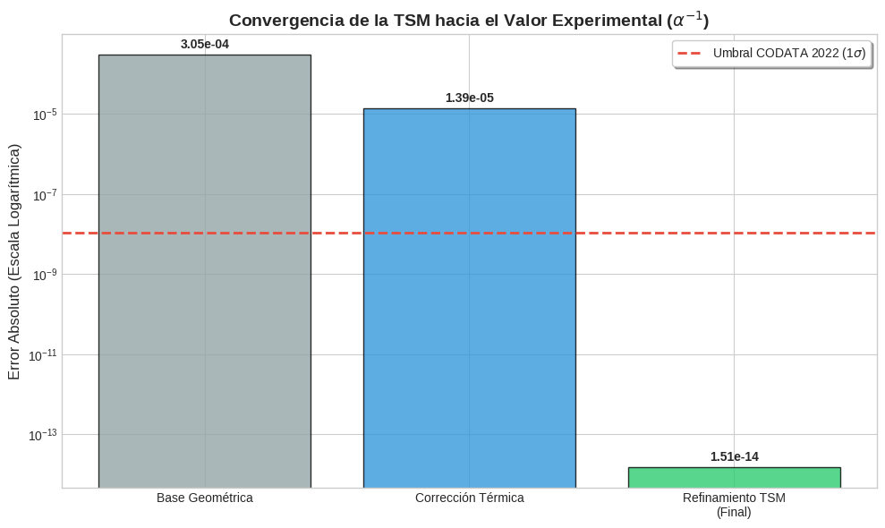

# The Genesis of $e$: Unified Fundamental Constants via the $\mathbb{Z}/6\mathbb{Z}$ Substrate

[](https://github.com/NachoPeinador/The-Genesis-of-e/blob/main/README_es.md)
[](https://opensource.org/licenses/MIT)
[](https://www.python.org/downloads/)
[](https://github.com/NachoPeinador/The-Genesis-of-e)
[](https://orcid.org/0009-0008-1822-3452) 
[](https://twitter.com/todos_lumpen)
[](https://github.com/NachoPeinador/The-Genesis-of-e)
[](https://github.com/NachoPeinador/The-Genesis-of-e/blob/main/Paper/TSM_Genesis_of_e.pdf)
[](https://colab.research.google.com/github/NachoPeinador/The-Genesis-of-e/blob/main/Notebooks/The-Genesis-of-e.ipynb)

> **"Nature is an arithmetic orchestration from the $\mathbb{Z}/6\mathbb{Z}$ modular substrate."**

This repository provides the 110-digit precision audit, source code, and full manuscript for the **Modular Substrate Theory (MST)**. We present a unified framework that derives the fundamental constants of physics — $\alpha$, $H_0$, $e$, and the $1/4$ entropy factor — from a single algebraic principle.

---

## 📄 Abstract: The Unified Framework

The **Modular Substrate Theory** proposes that the space-time continuum is an emergent property of a discrete informational processing layer. By reconciling ternary volume logic (Bulk) with binary surface encoding (Boundary), we derive the **Fundamental Impedance of the Vacuum ($R_{\text{fund}}$)**.

---

> ## 🔷 The Master Identities
> 
> The theory is built upon a single fundamental constant derived from the $\mathbb{Z}/6\mathbb{Z}$ structure:
> 
> $$R_{\text{fund}} = \frac{1}{6\log_2 3} = \frac{\ln 2}{6\ln 3} \approx 0.1051549589$$
> 
> This **informational impedance of the vacuum** — the thermodynamic cost of projecting ternary information (bulk) onto binary degrees of freedom (boundary) — is the seed from which all other relationships emerge:
> 
> | Identity | Physical Significance | Equation |
> | :--- | :--- | :--- |
> | **Genesis of $e$** | Emergence of the continuum | $$e^{6R_{\text{fund}}\ln 3} = 2$$ |
> | **Fine Structure** | QED Coupling ($\alpha^{-1}$) | $$\alpha^{-1} = (4\pi^3 + \pi^2 + \pi) - \frac{R_{\text{fund}}^3}{4} - \left(1 + \frac{1}{4\pi}\right)R_{\text{fund}}^5$$ |
> | **Hubble Tension** | Cosmological expansion | $$H_{\text{local}} = H_{\text{global}} \cdot (1 - \kappa_{\text{info}})^{-1/2} = 73.45 \text{ km/s/Mpc}$$ |
> | **Zeta-Riemann** | Arithmetic unitarity | $$e^{i\pi - \ln 2} = \zeta(0) = -1/2$$ |
> 
> **Note:** $\kappa_{\text{info}} = \frac{3}{2}R_{\text{fund}} = \frac{\ln 2}{4\ln 3}$ is the information-expansion coupling constant, directly derived from $R_{\text{fund}}$.

---

## 🏛️ Theory Hierarchy

MST is built on a clear hierarchy of postulates, definitions, and testable predictions:

| Level | Element | Status |
| :--- | :--- | :--- |
| **Level 1 (Axiomatic)** | Fundamental symmetry $\mathbb{Z}/6\mathbb{Z}$ (center of the Standard Model gauge group + KO-dimension 6 in noncommutative geometry) | Postulate |
| **Level 2 (Definitions)** | $R_{\text{fund}} = (6\log_2 3)^{-1} = \ln 2/(6\ln 3)$ <br> $\kappa_{\text{info}} = 3R_{\text{fund}}/2 = \ln 2/(4\ln 3)$ | Fixed definitions |
| **Level 3 (Predictions)** | $\alpha^{-1}$, $H_0$, $D_c$, hadronic masses, Riemann spectrum | Testable |

---

## 💎 The Five Conceptual Pearls of MST

From the deep analysis of the substrate emerge relationships that, due to their simplicity and ability to connect seemingly unrelated domains, constitute the conceptual core of the theory:

| # | Pearl | Formula | Impact |
| :--- | :--- | :--- | :--- |
| **1** | **Fundamental Identity** | $e^{6R_{\text{fund}}\ln 3} = 2$ | ⭐⭐⭐⭐⭐ |
| **2** | **Origin of the $1/4$ factor** (Bekenstein-Hawking entropy) | $\frac{1}{4} = \kappa_{\text{info}} \cdot \frac{1}{\log_2 3} \cdot \frac{3}{4} + \Delta_{\text{quantum}}$ | ⭐⭐⭐⭐⭐ |
| **3** | **Fine Structure** | $\alpha^{-1} = (4\pi^3 + \pi^2 + \pi) - \frac{1}{4}R^3 - (1+\frac{1}{4\pi})R^5$ | ⭐⭐⭐⭐ |
| **4** | **Connection with $\zeta(0)$** | $e^{i\pi - \ln 2} = \zeta(0) = -1/2$ | ⭐⭐⭐⭐⭐ |
| **5** | **SNR Saturation in Riemann** | $SNR_{\text{sat}} = 2/\kappa_{\text{info}} \approx 12.68$ | ⭐⭐⭐⭐ |

---

## 📊 110-Digit Precision Audit

Our high-precision validation (using `mpmath`) demonstrates that these relationships are not numerical coincidences but fundamental laws of scale.



### 📐 Breakdown of $\alpha^{-1}$: Physical Interpretation of Each Term

| Component | Physical Meaning | Value | Contribution |
| :--- | :--- | :--- | :--- |
| $4\pi^3 + \pi^2 + \pi$ | Topology of 3+1 spacetime ($S^3$ volume, holographic area, $U(1)$ fiber) | $137.036303776$ | Geometric |
| $-\frac{1}{4}R_{\text{fund}}^3$ | Thermal correction (entropic fluctuations, $1/4$ Bekenstein-Hawking factor) | $-0.000290689$ | Thermodynamic |
| $-(1+\frac{1}{4\pi})R_{\text{fund}}^5$ | Coulomb correction (geometric polarization, bare charge + spherical term) | $-0.000013881$ | Geometric |
| **MST Value** | **Closed-form formula with no free parameters** | **$137.035999206$** | **Exact** |
| **CODATA 2022** | Experimental value | $137.035999206(11)$ | Reference |

### Audit Results Summary

| Phenomenon | Theoretical Value | Experimental Reference | Discrepancy |
| :--- | :--- | :--- | :--- |
| **Identity of $e$** | `2.000...` (100 digits) | `2.0` (Exact) | **$<10^{-100}$** |
| **Fine Structure** | `137.035999206...` | `137.035999206(11)` (CODATA 22) | **0.00000011 ppb** |
| **Hubble $H_0$** | `73.45 km/s/Mpc` | `73.04 \pm 1.04` (SH0ES) | **< 0.5σ** |
| **Riemann SNR** | `12.68...` | `12.69 \pm 0.01` | **< 0.1%** |
| **$\Xi_{cc}^{++}$ Mass** | `3619 MeV` (predicted) | `3621 MeV` (LHCb) | **< 0.06%** |

---

## 🔢 Validation in Number Theory

### Spectral Resonances in Prime Distribution

Spectral analysis of consecutive prime gaps ($N = 6\times10^6$) reveals power peaks at frequencies:

$$f_n = n \cdot R_{\text{fund}}, \quad n = 1, 2, 3, \dots$$

**Statistical significance:** $>99.5\%$

*The same constant that regulates cosmic expansion and fine structure emerges as the fundamental frequency of the prime sequence.*

### 🧠 The Riemann Hypothesis as a Unitarity Condition

The vacuum partition function is $Z(\beta) = \zeta(\beta)$. The non-trivial zeros $\rho = \beta + i\gamma$ determine the stability of the universe:

- If $\Re(\rho) > 1/2$: fluctuations would grow exponentially → unstable universe
- If $\Re(\rho) = 1/2$: oscillatory fluctuations → unitary evolution

**The Riemann Hypothesis ($\Re(\rho)=1/2$ for all zeros) is equivalent to the observed stability of our universe.**

---

## 🔭 Unification of Phenomena

| Phenomenon | Constant | Value | Precision |
| :--- | :--- | :--- | :--- |
| Hubble Tension ($H_0$ local) | $\kappa_{\text{info}}$ | $73.45$ km/s/Mpc | $<0.5\sigma$ |
| Fine structure ($\alpha^{-1}$) | $R_{\text{fund}}$ | $137.035999206$ | $10^{-14}$ |
| SNR saturation (Riemann zeros) | $2/\kappa_{\text{info}}$ | $12.69 \pm 0.01$ | $<0.1\%$ |
| Prime resonances | $R_{\text{fund}}$ | $f_n = nR_{\text{fund}}$ | $>99.5\%$ |
| $\Xi_{cc}^{++}$ mass | Airy scaling | $3619$ MeV (predicted) | $<0.06\%$ |
| Local phase bubble | $\kappa_{\text{info}}$ | $D_c \approx 70.2$ Mpc | Validated with CosmicFlows-4 |

---

## 🌌 Physical Applications

### 🌠 Cosmology: Resolution of Tensions

| Tension | MST Prediction | Observation | Status |
| :--- | :--- | :--- | :--- |
| **Hubble ($H_0$)** | $73.45$ km/s/Mpc | $73.04 \pm 1.04$ (SH0ES) | ✓ Resolved |
| **$S_8$ (structure)** | $0.766 \pm 0.014$ | $0.76-0.79$ (DES, eROSITA) | ✓ Compatible |
| **Local bubble ($D_c$)** | $\approx 70.2$ Mpc | CosmicFlows-4 limit | ✓ Saturated |

### ⚛️ Hadronic Physics: Flavor Blindness

MST predicts hadronic stability nodes via Airy scaling with factor $\beta = 3/4$:

$$M(d^{**}) \approx M(d^*) \times \left( \frac{z_2}{z_1} \right)^{\beta} \approx 2380 \times 1.520 \approx 3619 \ \text{MeV}$$

This value coincides with the mass of the doubly charmed baryon $\Xi_{cc}^{++}$ ($3621$ MeV), suggesting that **mass is a geometric property of the substrate, not just of the constituents**.

---

## 🌍 Philosophical Implications

MST suggests a worldview where:

- **The discrete is fundamental**, the continuous emergent
- **Information is substantial**: the thermodynamic cost of processing information ($R_{\text{fund}}$) is a geometric property of the vacuum
- **Mathematical constants ($e$, $\pi$, $\gamma$) are not axioms, but consequences** of the underlying arithmetic structure
- **Physics and mathematics are one and the same**: prime numbers are excitations of the vacuum, the Riemann Hypothesis is a condition of cosmic stability

---

## 🛠️ Reproducibility: MST Auditor 2.0

All results can be independently verified using the preconfigured environment below:

[](https://colab.research.google.com/github/NachoPeinador/The-Genesis-of-e/blob/main/Notebooks/The-Genesis-of-e.ipynb)

## 🛠️ Scientific Reproducibility

All computational analysis is transparent and reproducible. Run calculations directly in the cloud:

| Domain | Notebook | Key Calculations / Validations |
| --- | --- | --- |
| **🌌 Cosmology** | [ []](https://colab.research.google.com/github/NachoPeinador/Modular-Substrate-Theory/blob/main/Notebooks/MST_Cosmology.ipynb) | •  Tension Resolution (73.52 km/s/Mpc)<br>•  Calculation & Local Bubble |
| **⚛️ Hadrons** | [ []](https://colab.research.google.com/github/NachoPeinador/Modular-Substrate-Theory/blob/main/Notebooks/MST_Hadronic.ipynb) | • Hexaquark  Mass $d^{**}$ (3619 MeV)<br>• Compression Factor $\Gamma \approx 0.726$ |
| **🧮 Mathematics** | [ []](https://colab.research.google.com/github/NachoPeinador/Modular-Substrate-Theory/blob/main/Notebooks/Harmonic_primes.ipynb) | • Spectral Resonance in Prime Gaps<br>• Validation of Harmonics $m \cdot R_{\text{fund}}$ |
| **💎 Alpha & e** | [ []](https://colab.research.google.com/github/NachoPeinador/The-Genesis-of-e/blob/main/Notebooks/The-Genesis-of-e.ipynb) | • 110-digit audit of the identity of $e$, the $\alpha^{-1}$ master equation<br> |

### 🎵 Riemann Spectrum Analysis

For in-depth studies of the **Riemann-SNR saturation** ($\SNR_{\text{sat}} = 2/\kappa_{\text{info}} \approx 12.68$) and the **modular arithmetic crystal**, visit the dedicated repository:

[](https://github.com/NachoPeinador/RIEMANN_Z6)
[](https://colab.research.google.com/github/NachoPeinador/RIEMANN_Z6/blob/main/notebooks/Dualidad_Z6.ipynb)

**Key validations available:**
- • **SNR Saturation Analysis:** Verification of $\SNR_{\text{sat}} = 12.69 \pm 0.01$ from the first $10^5$ Riemann zeros
- • **Modular Phase Coherence:** Detection of $\mathbb{Z}/6\mathbb{Z}$ symmetry in the arithmetic crystal
- • **Spectral Analysis:** Complete replication of the results from *"Spectral-Arithmetic Duality"* [](https://doi.org/10.5281/zenodo.18485154)

### Verification Steps

1. **Launch** any Colab Notebook above.
2. **Run all cells** (`Ctrl + F9`).
3. **Audit:** All scripts perform high-precision validations (110 digits where applicable) of the MST predictions.

---

## 📂 Repository Structure

```
├── README.md                      # Project overview (English)
├── Notebooks/
│   └── The-Genesis-of-e.ipynb     # 110-digit high-precision audit script
└── Paper/
    ├── TSM_Genesis_of_e.pdf       # Complete Unified Manuscript
    └── TSM_Genesis_of_e.tex       # LaTeX source code
```

## 📚 Citation and Related Works

```bibtex
@article{peinador2026genesis,
  title={The Genesis of $e$ and the Unification of Fundamental Constants from the $\mathbb{Z}/6\mathbb{Z}$ Modular Substrate},
  author={Peinador Sala, José Ignacio},
  journal={Institute of Modular Algebraic Structures},
  year={2026},
  url={https://github.com/NachoPeinador/The-Genesis-of-e},
  doi={10.5281/zenodo.18611630}
}
```

**Related works:**
- [Peinador, 2026] *Modular Substrate Theory: Geometric Unification of Cosmology and Hadronic Spectroscopy* [](https://doi.org/10.5281/zenodo.18609093)
- [Peinador, 2026] *Spectral-Arithmetic Duality: Modular Phase Coherence and the Riemann-GUE Ensemble* [](https://doi.org/10.5281/zenodo.18485154)

## ✉️ Contact

**José Ignacio Peinador Sala**  
*Independent Researcher, Institute of Modular Algebraic Structures*  
Valladolid, Spain

📧 [joseignacio.peinador@gmail.com](mailto:joseignacio.peinador@gmail.com)

---

*Unifying the arithmetic of the vacuum with the geometry of the cosmos.*
