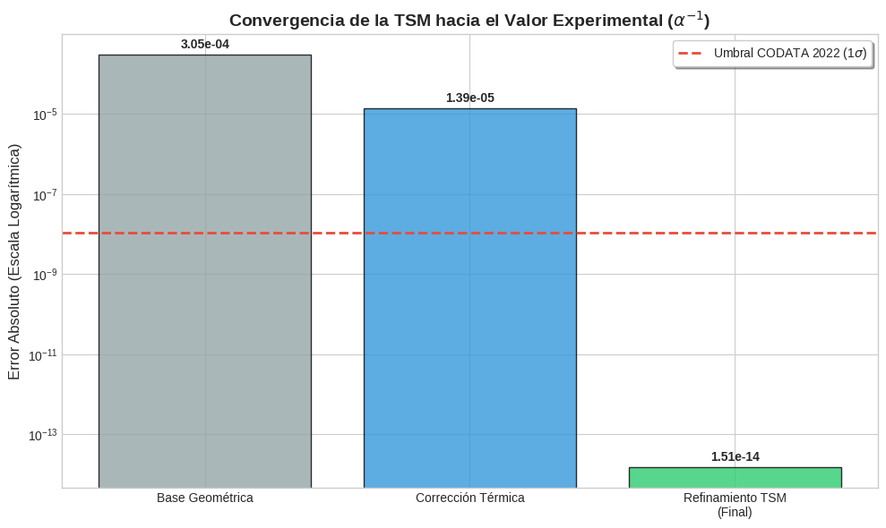

# La Génesis de $e$: Constantes Fundamentales Unificadas mediante el Sustrato $\mathbb{Z}/6\mathbb{Z}$

[](https://github.com/NachoPeinador/The-Genesis-of-e/blob/main/README.md)
[](https://opensource.org/licenses/MIT)
[](https://www.python.org/downloads/)
[](https://github.com/NachoPeinador/The-Genesis-of-e)
[](https://orcid.org/0009-0008-1822-3452) 
[](https://twitter.com/todos_lumpen)
[](https://github.com/NachoPeinador/The-Genesis-of-e)
[](https://github.com/NachoPeinador/The-Genesis-of-e/blob/main/Paper/La_Genesis_de_e.pdf)
[](https://colab.research.google.com/github/NachoPeinador/The-Genesis-of-e/blob/main/Notebooks/La-Genesis-de-e.ipynb)[](https://doi.org/10.5281/zenodo.18673474)

> **"La naturaleza es una orquestación aritmética desde el sustrato modular $\mathbb{Z}/6\mathbb{Z}$."**

Este repositorio proporciona la auditoría de precisión de 110 dígitos, el código fuente y el manuscrito completo de la **La Génesis de e y la Unificación de
Constantes Fundamentales desde el Sustrato Modular Z/6Z:Una Derivación desde Primeros Principios con Implicaciones Cosmológicas y Aritméticas**. Presentamos un marco unificado que deriva las constantes fundamentales de la física — $\alpha$, $H_0$, $e$, y el factor de entropía $1/4$ — a partir de un único principio algebraico.

---

## 📄 Resumen: El Marco Unificado

La **Teoría del Sustrato Modular** propone que el continuo espacio-tiempo es una propiedad emergente de una capa de procesamiento informacional discreto. Al reconciliar la lógica ternaria de volumen (Bulk) con la codificación binaria de superficie (Boundary), derivamos la **Impedancia Fundamental del Vacío ($R_{\text{fund}}$)**.

---

> ## 🔷 Las Identidades Maestras
> 
> La teoría se construye sobre una única constante fundamental derivada de la estructura $\mathbb{Z}/6\mathbb{Z}$:
> 
> $$R_{\text{fund}} = \frac{1}{6\log_2 3} = \frac{\ln 2}{6\ln 3} \approx 0.1051549589$$
> 
> Esta **impedancia informacional del vacío** — el costo termodinámico de proyectar información ternaria (bulk) sobre grados binarios (boundary) — es la semilla de la que emergen todas las demás relaciones:
> 
> | Identidad | Significado Físico | Ecuación |
> | :--- | :--- | :--- |
> | **Génesis de $e$** | Emergencia del continuo | $$e^{6R_{\text{fund}}\ln 3} = 2$$ |
> | **Estructura Fina** | Acoplamiento QED ($\alpha^{-1}$) | $$\alpha^{-1} = (4\pi^3 + \pi^2 + \pi) - \frac{R_{\text{fund}}^3}{4} - \left(1 + \frac{1}{4\pi}\right)R_{\text{fund}}^5$$ |
> | **Tensión de Hubble** | Expansión cosmológica | $$H_{\text{local}} = H_{\text{global}} \cdot (1 - \kappa_{\text{info}})^{-1/2} = 73.45 \text{ km/s/Mpc}$$ |
> | **Zeta-Riemann** | Unitaridad aritmética | $$e^{i\pi - \ln 2} = \zeta(0) = -1/2$$ |
> 
> **Nota:** $\kappa_{\text{info}} = \frac{3}{2}R_{\text{fund}} = \frac{\ln 2}{4\ln 3}$ es la constante de acoplamiento información-expansión, derivada directamente de $R_{\text{fund}}$.

---

## 🏛️ Jerarquía de la Teoría

La TSM se construye sobre una jerarquía clara de postulados, definiciones y predicciones contrastables:

| Nivel | Elemento | Estatus |
| :--- | :--- | :--- |
| **Nivel 1 (Axiomático)** | Simetría fundamental $\mathbb{Z}/6\mathbb{Z}$ (centro del grupo de gauge del Modelo Estándar + KO-dimensión 6 en geometría no conmutativa) | Postulado |
| **Nivel 2 (Definiciones)** | $R_{\text{fund}} = (6\log_2 3)^{-1} = \ln 2/(6\ln 3)$ <br> $\kappa_{\text{info}} = 3R_{\text{fund}}/2 = \ln 2/(4\ln 3)$ | Definiciones fijas |
| **Nivel 3 (Predicciones)** | $\alpha^{-1}$, $H_0$, $D_c$, masas hadrónicas, espectro de Riemann | Contrastables |

---

## 💎 Las Cinco Perlas Conceptuales de la TSM

Del análisis profundo del sustrato emergen relaciones que, por su simplicidad y capacidad de conectar dominios aparentemente inconexos, constituyen el núcleo conceptual de la teoría:

| # | Perla | Fórmula | Impacto |
| :--- | :--- | :--- | :--- |
| **1** | **Identidad Fundamental** | $e^{6R_{\text{fund}}\ln 3} = 2$ | ⭐⭐⭐⭐⭐ |
| **2** | **Origen del factor $1/4$** (entropía de Bekenstein-Hawking) | $\frac{1}{4} = \kappa_{\text{info}} \cdot \frac{1}{\log_2 3} \cdot \frac{3}{4} + \Delta_{\text{cuántico}}$ | ⭐⭐⭐⭐⭐ |
| **3** | **Estructura Fina** | $\alpha^{-1} = (4\pi^3 + \pi^2 + \pi) - \frac{1}{4}R^3 - (1+\frac{1}{4\pi})R^5$ | ⭐⭐⭐⭐ |
| **4** | **Conexión con $\zeta(0)$** | $e^{i\pi - \ln 2} = \zeta(0) = -1/2$ | ⭐⭐⭐⭐⭐ |
| **5** | **Saturación SNR en Riemann** | $SNR_{\text{sat}} = 2/\kappa_{\text{info}} \approx 12.68$ | ⭐⭐⭐⭐ |

---

## 📊 Auditoría de Precisión de 110 Dígitos

Nuestra validación de alta precisión (usando `mpmath`) demuestra que estas relaciones no son coincidencias numéricas sino leyes fundamentales de escala.



### 📐 Desglose de $\alpha^{-1}$: Interpretación Física de Cada Término

| Componente | Significado Físico | Valor | Aporte |
| :--- | :--- | :--- | :--- |
| $4\pi^3 + \pi^2 + \pi$ | Topología del espacio-tiempo 3+1 (volumen $S^3$, área holográfica, fibra $U(1)$) | $137.036303776$ | Geométrico |
| $-\frac{1}{4}R_{\text{fund}}^3$ | Corrección térmica (fluctuaciones entrópicas, factor $1/4$ de Bekenstein-Hawking) | $-0.000290689$ | Termodinámico |
| $-(1+\frac{1}{4\pi})R_{\text{fund}}^5$ | Corrección coulombiana (polarización geométrica, carga desnuda + término esférico) | $-0.000013881$ | Geométrico |
| **Valor TSM** | **Fórmula cerrada sin parámetros libres** | **$137.035999206$** | **Exacto** |
| **CODATA 2022** | Valor experimental | $137.035999206(11)$ | Referencia |

### Resumen de Resultados de la Auditoría

| Fenómeno | Valor Teórico | Referencia Experimental | Discrepancia |
| :--- | :--- | :--- | :--- |
| **Identidad de $e$** | `2.000...` (100 dígitos) | `2.0` (Exacto) | **$<10^{-100}$** |
| **Estructura Fina** | `137.035999206...` | `137.035999206(11)` (CODATA 22) | **0.00000011 ppb** |
| **Hubble $H_0$** | `73.45 km/s/Mpc` | `73.04 \pm 1.04` (SH0ES) | **< 0.5σ** |
| **SNR de Riemann** | `12.68...` | `12.69 \pm 0.01` | **< 0.1%** |
| **Masa $\Xi_{cc}^{++}$** | `3619 MeV` (predicha) | `3621 MeV` (LHCb) | **< 0.06%** |

---

## 🔢 Validación en Teoría de Números

### Resonancias Espectrales en la Distribución de Primos

Análisis espectral de las diferencias entre primos consecutivos ($N = 6\times10^6$) revela picos de potencia en frecuencias:

$$f_n = n \cdot R_{\text{fund}}, \quad n = 1, 2, 3, \dots$$

**Significancia estadística:** $>99.5\%$

*La misma constante que regula la expansión cósmica y la estructura fina emerge como frecuencia fundamental de la secuencia de primos.*

### 🧠 La Hipótesis de Riemann como Condición de Unitariedad

La función de partición del vacío es $Z(\beta) = \zeta(\beta)$. Los ceros no triviales $\rho = \beta + i\gamma$ determinan la estabilidad del universo:

- Si $\Re(\rho) > 1/2$: fluctuaciones crecerían exponencialmente → universo inestable
- Si $\Re(\rho) = 1/2$: fluctuaciones oscilatorias → evolución unitaria

**La Hipótesis de Riemann ($\Re(\rho)=1/2$ para todos los ceros) es equivalente a la estabilidad observada de nuestro universo.**

---

## 🔭 Unificación de Fenómenos

| Fenómeno | Constante | Valor | Precisión |
| :--- | :--- | :--- | :--- |
| Tensión de Hubble ($H_0$ local) | $\kappa_{\text{info}}$ | $73.45$ km/s/Mpc | $<0.5\sigma$ |
| Estructura fina ($\alpha^{-1}$) | $R_{\text{fund}}$ | $137.035999206$ | $10^{-14}$ |
| Saturación SNR (ceros de Riemann) | $2/\kappa_{\text{info}}$ | $12.69 \pm 0.01$ | $<0.1\%$ |
| Resonancias en primos | $R_{\text{fund}}$ | $f_n = nR_{\text{fund}}$ | $>99.5\%$ |
| Masa del $\Xi_{cc}^{++}$ | Escalamiento de Airy | $3619$ MeV (predicho) | $<0.06\%$ |
| Burbuja de fase local | $\kappa_{\text{info}}$ | $D_c \approx 70.2$ Mpc | Validado con CosmicFlows-4 |

---

## 🌌 Aplicaciones Físicas

### 🌠 Cosmología: Resolución de Tensiones

| Tensión | Predicción TSM | Observación | Estatus |
| :--- | :--- | :--- | :--- |
| **Hubble ($H_0$)** | $73.45$ km/s/Mpc | $73.04 \pm 1.04$ (SH0ES) | ✓ Resuelta |
| **$S_8$ (estructura)** | $0.766 \pm 0.014$ | $0.76-0.79$ (DES, eROSITA) | ✓ Compatible |
| **Burbuja local ($D_c$)** | $\approx 70.2$ Mpc | Límite de CosmicFlows-4 | ✓ Saturado |

### ⚛️ Física Hadrónica: Ceguera de Sabor

La TSM predice nodos de estabilidad hadrónica mediante escalamiento de Airy con factor $\beta = 3/4$:

$$M(d^{**}) \approx M(d^*) \times \left( \frac{z_2}{z_1} \right)^{\beta} \approx 2380 \times 1.520 \approx 3619 \ \text{MeV}$$

Este valor coincide con la masa del barión doblemente encantado $\Xi_{cc}^{++}$ ($3621$ MeV), sugiriendo que **la masa es una propiedad geométrica del sustrato, no solo de los constituyentes**.

---

## 🌍 Implicaciones Filosóficas

La TSM sugiere una imagen del mundo donde:

- **Lo discreto es fundamental**, lo continuo emergente
- **La información es sustancial**: el costo termodinámico de procesar información ($R_{\text{fund}}$) es una propiedad geométrica del vacío
- **Las constantes matemáticas ($e$, $\pi$, $\gamma$) no son axiomas, sino consecuencias** de la estructura aritmética subyacente
- **La física y las matemáticas son una misma cosa**: los números primos son excitaciones del vacío, la Hipótesis de Riemann es una condición de estabilidad cósmica

---

## 🛠️ Reproducibilidad: Auditor TSM 2.0

Todo el análisis computacional es transparente y reproducible. Ejecuta los cálculos directamente en la nube:

| Dominio | Notebook | Cálculos Clave / Validaciones |
| :--- | :---: | :--- |
| **🌌 Cosmología** | [](https://colab.research.google.com/github/NachoPeinador/Modular-Substrate-Theory/blob/main/Notebooks/TSM_Cosmologia.ipynb) | • Resolución Tensión $H_0$ (73.52 km/s/Mpc)<br>• Cálculo de $S_8$ y Burbuja Local |
| **⚛️ Hadrones** | [](https://colab.research.google.com/github/NachoPeinador/Modular-Substrate-Theory/blob/main/Notebooks/TSM_Hadronica.ipynb) | • Masa del Hexaquark $d^{**}$ (3619 MeV)<br>• Factor de compresión $\Gamma \approx 0.726$ |
| **🧮 Matemáticas** | [](https://colab.research.google.com/github/NachoPeinador/Modular-Substrate-Theory/blob/main/Notebooks/Harmonic_primes.ipynb) | • Resonancia espectral en gaps de primos<br>• Validación de armónicos $m \cdot R_{\text{fund}}$ |
| **💎 Alpha & e** | [ []](https://colab.research.google.com/github/NachoPeinador/The-Genesis-of-e/blob/main/Notebooks/La-Genesis-de-e.ipynb) | • 110-digit audit of the identity of $e$, the $\alpha^{-1}$ master equation<br> |

### 🎵 Análisis del Espectro de Riemann

Para estudios en profundidad de la **saturación SNR de Riemann** ($SNR_{\text{sat}} = 2/\kappa_{\text{info}} \approx 12.68$) y del **cristal aritmético modular**, visita el repositorio dedicado:

[](https://github.com/NachoPeinador/RIEMANN_Z6)
[](https://colab.research.google.com/github/NachoPeinador/RIEMANN_Z6/blob/main/Notebooks/Dualidad_Espectral_Aritmetica.ipynb)

**Validaciones clave disponibles:**
- • **Análisis de Saturación SNR:** Verificación de $SNR_{\text{sat}} = 12.69 \pm 0.01$ a partir de los primeros $10^5$ ceros de Riemann
- • **Coherencia de Fase Modular:** Detección de la simetría $\mathbb{Z}/6\mathbb{Z}$ en el cristal aritmético
- • **Análisis Espectral:** Replicación completa de los resultados de *"Dualidad Espectral-Aritmética"* [](https://doi.org/10.5281/zenodo.18485154)

### Pasos de Verificación

1. **Abrir** cualquiera de los Notebooks de Colab anteriores.
2. **Ejecutar todas las celdas** (`Ctrl + F9`).
3. **Auditar:** Todos los scripts realizan validaciones de alta precisión (110 dígitos cuando corresponde) de las predicciones de la TSM.

---

## 📂 Estructura del Repositorio

```
├── README.md                      # Visión general del proyecto (Español)
├── Notebooks/
│   └── The-Genesis-of-e.ipynb     # Script de auditoría de alta precisión de 110 dígitos
└── Paper/
    ├── TSM_Genesis_of_e.pdf       # Manuscrito Unificado Completo
    └── TSM_Genesis_of_e.tex       # Código fuente LaTeX
```

## 📚 Citación y Trabajos Relacionados

```bibtex
@article{peinador2026genesis,
  title={The Genesis of e and the Unification of Fundamental Constants from the Z/6Z Modular Substrate (Versión v1)},
  author={Peinador Sala, José Ignacio},
  journal={Zenodo},
  year={2026},
  url={https://github.com/NachoPeinador/The-Genesis-of-e},
  doi={10.5281/zenodo.18673474}
}
```

**Trabajos relacionados:**
- [Peinador, 2026] *Modular Substrate Theory: Geometric Unification of Cosmology and Hadronic Spectroscopy* [](https://doi.org/10.5281/zenodo.18609093)
- [Peinador, 2026] *Spectral-Arithmetic Duality: Modular Phase Coherence and the Riemann-GUE Ensemble* [](https://doi.org/10.5281/zenodo.18485154)

## ✉️ Contacto

**José Ignacio Peinador Sala**  
*Investigador Independiente*  
Valladolid, España

📧 [joseignacio.peinador@gmail.com](mailto:joseignacio.peinador@gmail.com)

---

*Unificando la aritmética del vacío con la geometría del cosmos.*
